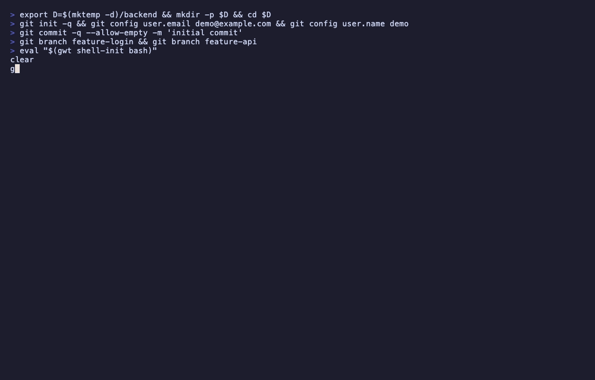

# gwt

[](https://github.com/kyriacos/go-gwt/actions/workflows/ci.yml)
[](https://pkg.go.dev/github.com/kyriacos/go-gwt)
[](LICENSE)

A fast git worktree helper with a terminal UI and `gh` integration. Worktrees
land as siblings of your repo (`~/code/backend` → `~/code/backend-feature`).



## Install

From a clone (recommended for development):

```sh
bash scripts/install.sh
```

That installs to `$(go env GOPATH)/bin/gwt`, prints `gwt version`, and reminds you to refresh shell integration (below).

Release install:

```sh
go install github.com/kyriacos/go-gwt/cmd/gwt@latest
```

Manual install from a clone: `go install ./cmd/gwt`. To overwrite a binary in `~/.local/bin`: `GOBIN=~/.local/bin go install ./cmd/gwt`.

**After every install**, re-run shell integration so the wrapper pins the binary you just built — see [Shell integration](#shell-integration). `gwt version` shows which binary is running (`binary: …`); if it does not match your install path, refresh shell-init or remove a stale copy on `PATH` (e.g. `~/.local/bin/gwt`).

Prebuilt binaries: [releases](https://github.com/kyriacos/go-gwt/releases).

Optional: [`gh`](https://cli.github.com/) for PR checkout, [`fzf`](https://github.com/junegunn/fzf) if you prefer fzf pickers over the built-in TUI.

## Quickstart

```sh
gwt co feature        # switch to a worktree (create if needed)
gwt new feature       # new branch + worktree
gwt                   # dashboard (in a tty)
gwt ls                # list worktrees
gwt pr 1234           # PR into a fresh worktree
gwt clean             # remove stale worktrees
```

Use `gwt <command> --help` for full docs on any command (colored, with examples).

## Commands

| Command | What it does |
|---------|----------------|
| `co` | Switch to a worktree; create from branch if missing (`checkout`) |
| `new` | New branch + worktree |
| `from` | Worktree for an existing branch |
| `search` | Pick a worktree (`pick`) |
| `rm` | Remove a worktree (`remove`) |
| `clean` | Multi-select removal; `--merged` for a sweep |
| `ls` | List worktrees (`list`) |
| `pr` | Check out a GitHub PR |
| `dashboard` | Full-screen TUI |
| `st` | `git status -sb` (`status`) |
| `log` | Short git log graph |
| `prune` | `git worktree prune` |
| `shell-init` | Shell wrapper for auto-`cd` |
| `version` | Version info |

Interactive pickers use the built-in TUI by default (branch log preview, dashboard). Pass `--fzf` for fzf pickers.

## Shell integration

The shell wrapper pins the absolute path of the `gwt` binary that generated it
(`_GWT_BIN`), so `command gwt` cannot silently pick up a stale copy elsewhere
on `PATH`. Switch verbs pass the cd target via `GWT_PATH_OUT` (not stdout
capture) so Cursor setup can stream progress while the wrapper waits.
**Re-run shell-init after every `go install` or `scripts/install.sh`.**

Add to `~/.zshrc` (or bash/fish equivalent). Use the binary you intend to run:

```sh
eval "$(~/go/bin/gwt shell-init zsh)"
```

After that, `gwt co` / `gwt new` / `gwt search` drop you into the chosen worktree.
Check `gwt version` — the `binary:` line should match the path above.

```sh
export GWT_AUTO_LS=1          # run gwt ls after each switch
export GWT_WORKTREE_DIR=~/wt  # default parent for new worktrees
```

Different binary name (e.g. legacy bash `oldgwt` side-by-side):

```sh
eval "$(gwt shell-init zsh --name oldgwt)"
```

## Configuration

Global: `~/.config/gwt/config.toml`. Per-repo override: `.gwt.toml` at the main worktree root.

```toml
worktree_dir = ""                # default: parent of the repo
naming       = "{repo}-{branch}"
editor       = "cursor"          # used with --open / open_editor
tmux         = false

[cursor]
worktree_setup = "prompt"        # prompt | always | never

[claude]
worktree_setup = "prompt"

[remove]
delete_branch = false            # gwt rm: delete branch by default (like -d)
force_delete_branch = false      # gwt rm: force-delete (like -D)

[ui]
picker = "tui"                   # tui (default) | fzf
color  = "always"

[hooks]
post_create = ["npm install"]
pre_remove  = []
```

Flags like `--path`, `--fzf`, `--cursor-no-setup`, and `--open` override per invocation.
See `gwt co --help` for the full flag list.

## Contributing

See [CONTRIBUTING.md](CONTRIBUTING.md).

## License

MIT — [LICENSE](LICENSE).
